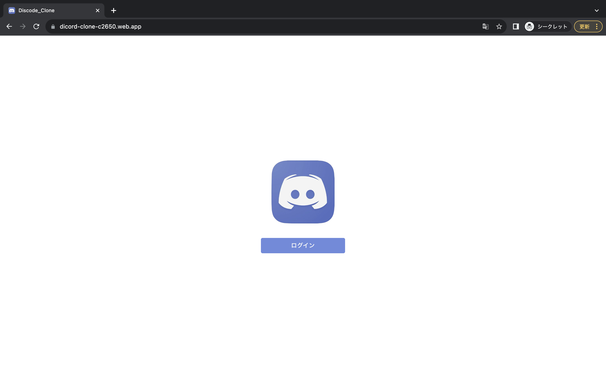
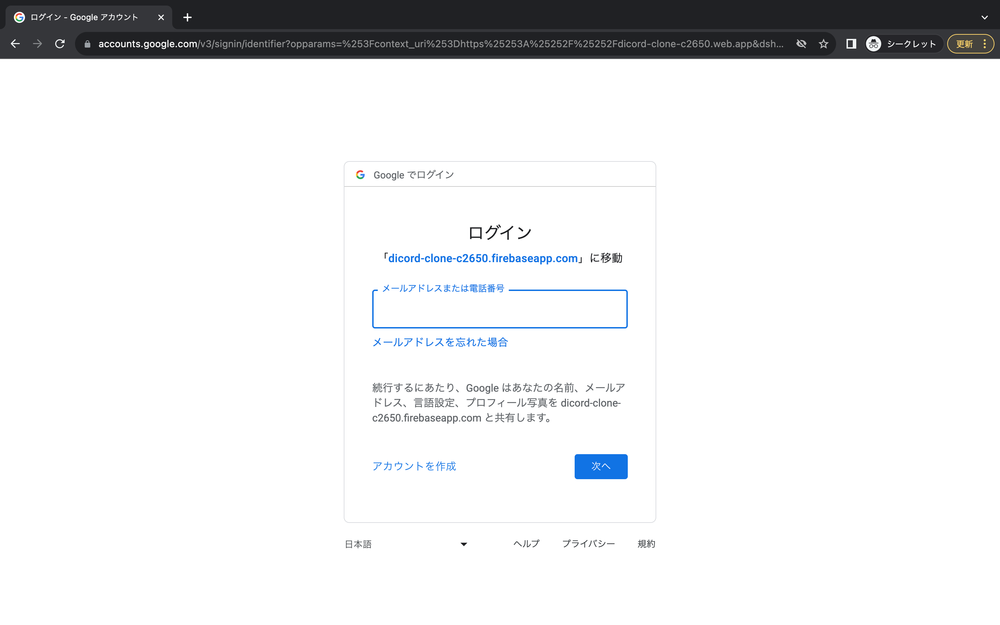
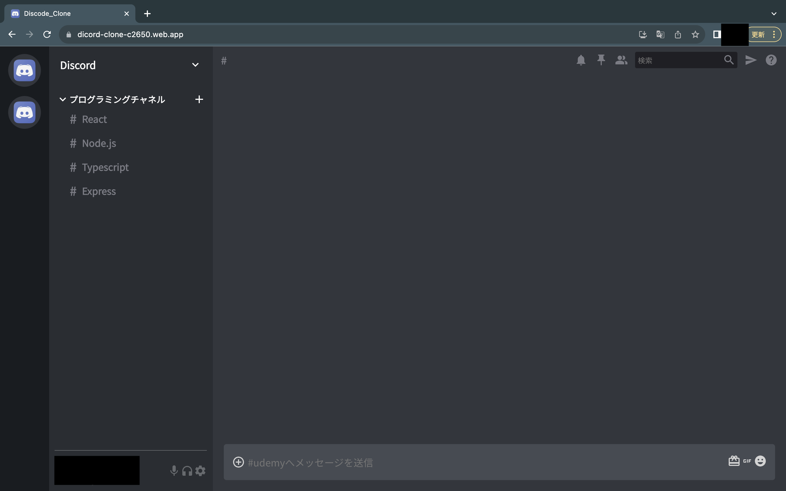
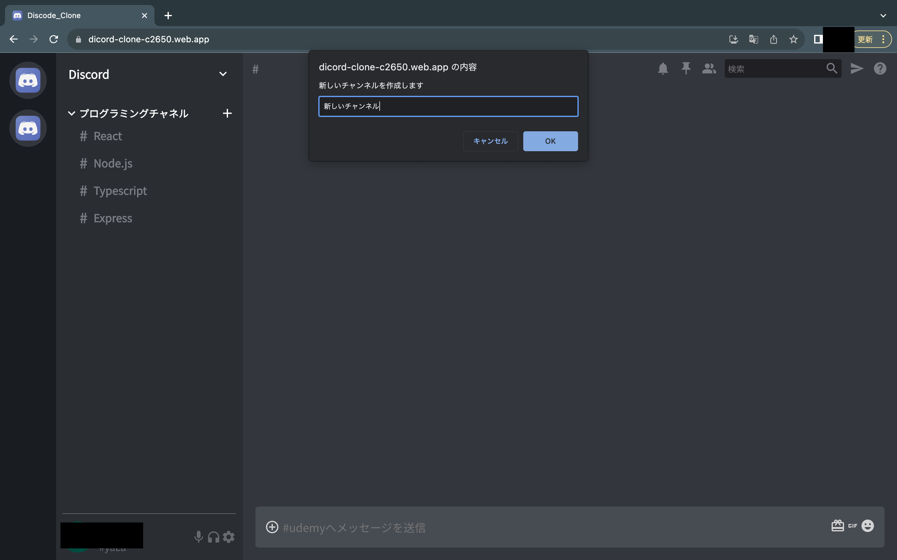
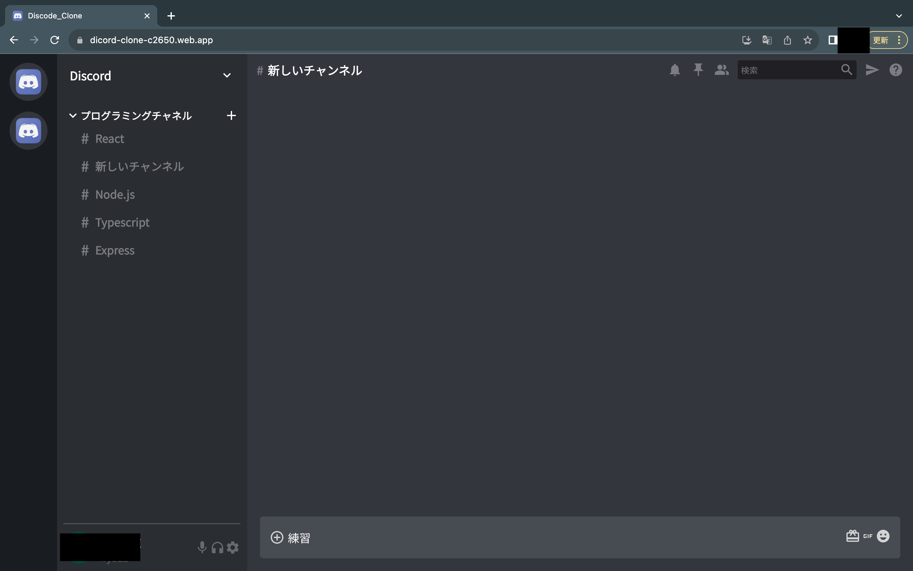
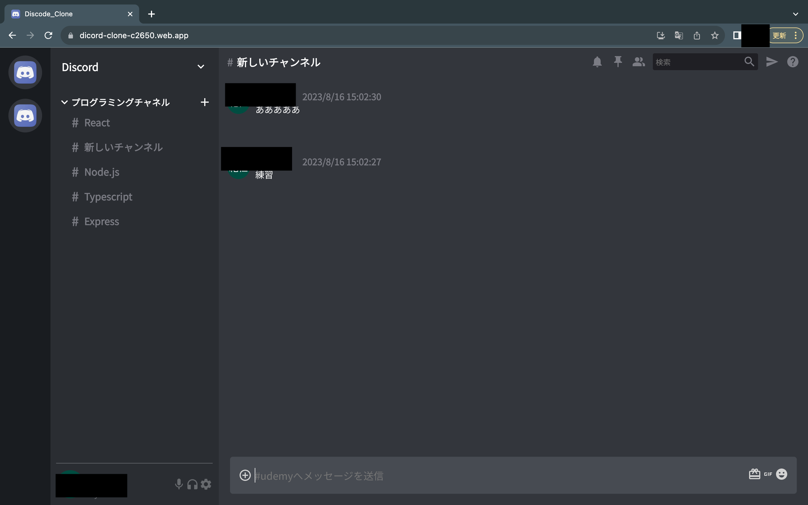

# 使用方法

本アプリは、typescript、react(reduxやhooksなど)、firebaseを用いたdiscordのクローンアプリです。 
URL：https://dicord-clone-c2650.web.app/

1\. こちらがログイン画面となっており、「ログイン」ボタンを押下することで、Google認証ページに飛ばされます。

 

2\. 次に、Googleログイン画面でGmailとパスワードを入力することで、ログインすることができます。

 

3\. ログインに成功すると、以下のようなdiscordクローンのチャットページに飛ばされます。

 

4\. また、プログラミングチャンネルの右にあるプラスボタンを押すことで、チャンネルを新しく作ることができます。

 

5\. このように新しいチャンネルに移動することができ、下部のテキスト入力欄にテキストを入力してエンターキーを押すことでメッセージを送信することができます。

 

6\. 先ほど送信したメッセージは以下のように表示され、送信日時の早い順から上部に表示されます。

